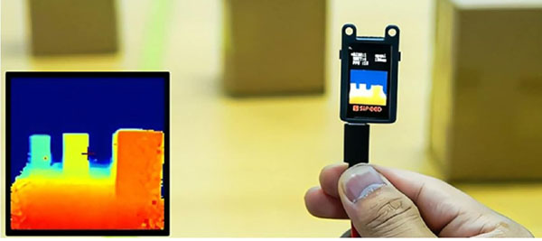
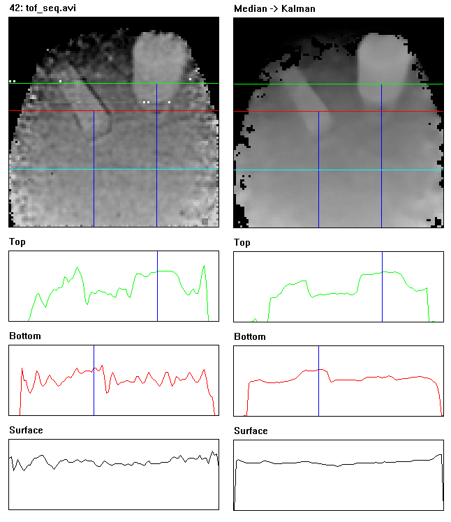

# tof_cam
## Compact imaging depth sensor 

[Sipeed](https://wiki.sipeed.com/hardware/en/maixsense/maixsense-a010/maixsense-a010.html) has a small, cheap ($35) sensor called the [MaixSense A010](https://www.amazon.com/A010-Depth-Vision-Camera-Sensor/dp/B0BWM21YK8) which produces a 100x100 pixel depth map using time-of-flight (TOF). This is great for small robots, except the depth image is very noisy (especially close up). The code here provides a Linux USB driver for the sensor along with image cleanup post-processing. First, a 5x5 median filter is used to eliminate edge artifacts and shot noise. After this, a Kalman-like temporal filter removes residual flickering and pulsing in the depth values. The images below demonstrate the improvement.

This scene is from 180mm above a table (yes, it images that close) of a 20mm block and a 60mm bottle. The pixel values are inverted so closer things appear brighter. There are 3 horizontal depth slices taken through the image: one across the bottle (green), one across the block (red), and one of the table (cyan). The goal is to be able to separate the objects from the surface they are resting on. As can be seen on the left, the original image does not have very distinct depth boundaries (and the values wiggle over time). However, after processing, the image on the right has a much smoother (and stable) ground plane which makes detection much easier.

### Using the Library

This system was developed for a [robot](https://github.com/jconnell11/Ganbei) with a Raspberry Pi 4B computer running 64 bit Bullseye. Yet the code is fairly vanilla and should compile for other Linux-based systems as well. To set things up, connect the sensor to a USB port (USB 2.0 is okay) then do:

    cd tof_cam
    cmake .
    make

This will create the library "libtof_cam.so" and the executables [tof_save](src/tof_save.cpp) and [tof_show](src/tof_show.cpp). The save utility will just grab a number of sequential frames from the sensor and store the raw versions as bitmap files. By contrast, the show utility will pop up 4 windows displaying live images of the various stages of processing. There is also a Python [wrapper](tof_cam.py) for the system that will produce OpenCV images. You can run a simple test of this by typing:

    python3 tof_cam.py

All these programs make use of the C++ base class [jhcTofCam](src/jhcTofCam.cpp). This contains the USB serial interface, background image processing, and an automatic range-step setting algorithm. Generally, for image analysis such as object detection, you will want to use the image returned by "Range" (also in Python). This is a 100x100 pixel image with 16 bit depth values in increments of 0.25mm (similar to Kinect 360). The sensor itself can see from about 50mm (2 inches) to 2.4m (8 feet). 

__Note:__ The onboard Raspberry USB hub is quirky. If you happen to plug in a [Waveshare USB sound card](https://www.amazon.com/gp/product/B08R38TXXL) it will crash the  TOF sensor! The solution is to add  a [USB splitter](https://www.amazon.com/dp/B07ZZ9ZSW9) (or hub) and plug one or the other (or both) peripherals into this instead.

---

July 2024 - Jonathan Connell - jconnell@alum.mit.edu

